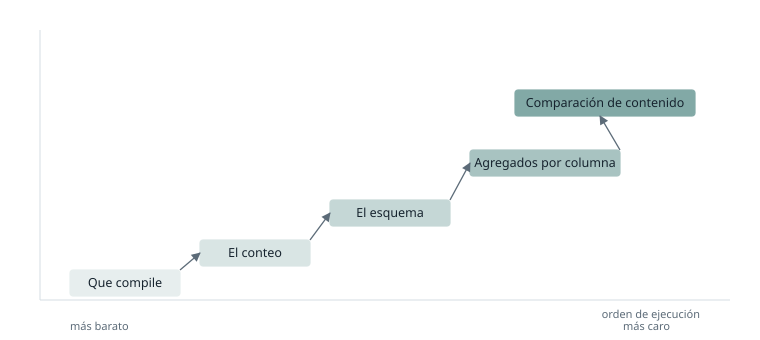

Un problema recurrente en cualquier proceso de migración es decidir qué indicadores determinan que un objeto se ha migrado del todo. Parece una pregunta menor y no lo es, porque de esa decisión cuelgan consecuencias muy claras: se cierra una tarea, se da por cumplido un hito, y alguien empieza a construir encima de ese objeto dando por hecho que es correcto.

Si hablamos de tablas, la primera respuesta que a todos se nos viene a la cabeza es el conteo de filas. Si origen y destino tienen el mismo número de registros, el objeto está migrado. Y esa respuesta funciona hasta que el objeto se consume en una capa de explotación, normalmente un informe, y empiezan a aparecer fallos en la lógica de las consultas que la validación no había detectado.

Conviene acotar el escenario del que hablo, porque las conclusiones cambian mucho según el punto de partida. Me refiero a migraciones de consultas extensas, con muchas fuentes distintas, desarrolladas por otras personas y sin documentación asociada. Esto no es una situación excepcional: es lo habitual. Cuando te asignan una migración, casi nunca migras lo que tú construiste, sino lo que construyó alguien que ya no está, con criterios que nadie escribió y con reglas de negocio que solo existen dentro de la propia consulta. Eso significa que no puedes validar comparando contra lo que debería salir, porque nadie sabe qué debería salir. Solo puedes comparar el resultado nuevo contra el antiguo: el sistema original es la única especificación disponible.

Hay además un factor que rara vez se menciona y que determina el resultado tanto como la técnica. En los proyectos reales no hay presupuesto infinito y el calendario suele ir justo. Cuando las fechas empiezan a moverse, se toman decisiones orientadas a llegar al plazo, y una de las más frecuentes es dar por buena una validación de conteo y esquema. Es una decisión comprensible y casi siempre equivocada, porque el ahorro es inmediato y el coste es diferido: los problemas de una validación floja no aparecen durante el desarrollo, sino al conectar la capa de explotación, que es lo último que se hace. Es decir, aparecen justo cuando ya no queda margen para corregirlos.

Aquí es donde un consultor con varias migraciones a sus espaldas aporta valor real. No en escribir mejor SQL, sino en saber que ese atajo se paga al final y en haber planificado la validación desde el principio para no tener que tomarlo.

En lo que sigue describo qué validaciones tienen sentido, en qué orden y por qué, y qué decisiones hay que tomar antes de empezar.

## Las dos restricciones que lo condicionan todo

Antes de entrar en técnicas, hay dos limitaciones del entorno que descartan por sí solas buena parte de lo que se lee sobre este tema.

La primera es que origen y destino no siempre viven en el mismo sitio. Cuando los objetos están en instancias distintas, la comparación no puede resolverse dentro del motor con una consulta que cruce ambos lados. Hay que abrir dos conexiones, pedir algo a cada una y comparar los resultados fuera. Eso impone una condición dura: lo que cada lado devuelve tiene que ser pequeño. No es viable traerse dos tablas de millones de filas para compararlas en memoria.

La segunda es la concurrencia. Las consultas de validación no se ejecutan en el vacío: compiten por los mismos recursos que las cargas reales. Un barrido completo sobre cada objeto migrado es técnicamente posible y operativamente inviable, porque multiplicado por el número de objetos de una migración deja el entorno inutilizable para todo lo demás.

De ahí sale el principio que ordena todo lo que viene después: la validación debe plantearse como una cascada en la que cada peldaño cuesta más que el anterior y solo se ejecuta si el anterior no ha detectado nada. El orden es lo que importa: de más barata a más cara, deteniéndose en cuanto una falle.

## Por qué el conteo engaña

El conteo es necesario. Es barato, se ejecuta en las dos instancias por separado, devuelve un único número por lado y no hay excusa para no hacerlo. El problema es creerse el resultado sin más.

El caso que mejor lo ilustra es un cruce mal reproducido que duplica filas, combinado con un filtro que se ha perdido por el camino y que eliminaba aproximadamente esas mismas filas. El conteo cuadra. El contenido no tiene nada que ver. Y como el conteo ha dado verde, el objeto se da por bueno y el error aparece semanas después, en el informe, delante de un usuario de negocio.

Este tipo de compensación no es raro en consultas complejas. Cuantas más fuentes intervienen, más probable es que dos errores independientes acaben cancelándose en el recuento total.

## La cascada, peldaño a peldaño

### Que compile

Antes que nada, la consulta migrada tiene que ejecutarse. Suena trivial y es donde caen muchos objetos: las diferencias de dialecto entre motores afectan sobre todo a las funciones de fecha, a los casteos de tipos y al tratamiento de nulos. Cuesta prácticamente nada y descarta lo grosero. No es una validación de resultado, es un requisito previo.

### El conteo

Ya comentado. Barato, obligatorio, insuficiente. Sirve para descartar, nunca para confirmar.

### El esquema

El siguiente peldaño natural es comparar el esquema: número de columnas, nombres y tipos. También devuelve poca información por lado, así que sigue siendo compatible con la restricción de las dos conexiones.

Merece la pena detenerse en la posición de las columnas. Normalmente es irrelevante, pero deja de serlo cuando algún proceso aguas abajo consume la tabla sin lista explícita de columnas. El caso más habitual hoy son los proyectos de dbt: si un modelo se construye seleccionando todas las columnas de otro, o si varios modelos se combinan mediante uniones, el orden se propaga y una discrepancia se arrastra por toda la cadena sin que nada avise. Por eso lo primero es averiguar si alguien depende de esa posición, y solo entonces decidir si hace falta validarla.

Llegado a este punto se ha validado que el contrato de la tabla se mantiene. Pero seguimos sin haber mirado el contenido.

### Los agregados por columna

Este es el peldaño que más rinde y el que más veces se omite.

Consiste en pedir a cada lado un resumen por columna: suma, mínimo, máximo, número de valores distintos y número de nulos. Devuelve unas pocas cifras por columna, así que funciona con dos conexiones separadas, no mueve datos y cuesta una consulta por lado.

Y detecta la mayor parte de las discrepancias reales. Si un cruce está duplicando filas, el número de distintos de la clave y el conteo dejan de ser coherentes entre sí. Si un casteo ha perdido precisión, la suma se desvía. Si sobra un filtro, el mínimo o el máximo se desplazan. Si una columna se ha quedado sin poblar, el conteo de nulos se dispara.

Tiene además una ventaja que no ofrece ninguno de los peldaños siguientes: indica en qué columna está el problema. Eso convierte la validación en algo accionable directamente, sin necesidad de bajar al nivel de fila.

### La comparación de contenido

Cuando los agregados no detectan nada pero el objeto exige una comprobación más estricta, hay que comparar el contenido completo. Cómo se hace depende de un factor: si origen y destino son accesibles desde la misma conexión o no.

**Si comparten motor y conexión**, la herramienta natural es la diferencia de conjuntos, y tiene que ser bidireccional. Restar el destino al origen devuelve las filas que faltan en destino; restar el origen al destino devuelve las que sobran. Con una sola dirección se detectan las pérdidas pero no las duplicaciones ni las filas añadidas de más, que es justo el caso que el conteo ya había dejado pasar. Si ambas direcciones vuelven vacías, el contenido es idéntico, y lo que devuelven cuando no lo es son exactamente las filas discrepantes, lo que encadena directamente con el diagnóstico.

**Si están en instancias distintas**, esa comparación no es posible: no se pueden cruzar dos conexiones en una consulta. Y aquí aparece además el problema de fondo del escenario descrito al principio: para comparar filas hay que poder emparejarlas, y para emparejarlas hace falta una clave que identifique cada fila de forma estable. Si no se conoce el negocio, no se sabe cuál es esa clave. Puede que ni exista.

La salida es calcular un hash por fila a partir de todas sus columnas y comparar los conjuntos de hashes de ambos lados. El hash proporciona un identificador sin necesidad de entender qué significa la fila, y reduce cada registro a un valor corto, de modo que lo que viaja entre instancias es manejable.

Dos precauciones sobre el hash. La primera es que solo es comparable si ambos lados lo construyen exactamente igual: mismo orden de columnas, casteos explícitos y un criterio claro sobre cómo se representan los nulos. Cualquier divergencia ahí genera diferencias que no son diferencias de datos. La segunda es que indica que la fila difiere, pero no en qué. Se gana capacidad de detección y se pierde capacidad de diagnóstico, razón de más para no saltarse el peldaño anterior.

## Validar no es diagnosticar

Buena parte de la confusión sobre este tema viene de mezclar dos preguntas distintas.

Validar es responder si el objeto es correcto. Es una respuesta binaria, debe ser barata y debe poder ejecutarse muchas veces sobre muchos objetos.

Diagnosticar es responder por qué no lo es. Es exploratorio, caro por definición, y solo tiene sentido cuando la validación ya ha fallado.

La comparación por columna sirve para validar; la comparación por fila, para diagnosticar. A nivel de negocio el significado está en la fila, porque una fila es un hecho completo y una columna aislada no significa nada por sí sola. Pero ese significado la convierte en la unidad de investigación, no en la de validación. Se valida por columna porque es lo barato, y se baja a fila solo cuando ya se sabe que hay algo que investigar.

## Los falsos positivos

Todo lo anterior describe el caso limpio. En la práctica, el primer día que se ejecuta una validación de contenido sobre objetos reales, falla todo. Y no porque la migración esté mal.

Las causas suelen ser tres. La precisión y el redondeo: dos motores con implementaciones distintas de tipos numéricos producen resultados que difieren en el último decimal, ninguno de los dos está mal y el validador los marca como discrepancia. Los timestamps: diferencias de zona horaria, de precisión o de momento de ejecución generan valores que no van a coincidir jamás. Y las columnas de proceso: fechas de carga, identificadores técnicos, marcas de auditoría, que nunca van a coincidir ni en tipo ni en contenido, y es correcto que no coincidan.

De ahí se sigue la conclusión que me parece más relevante de todo esto: la decisión de qué comparar y qué ignorar no es técnica, sino semántica. Depende de si la columna significa algo para el negocio o si es un metadato del propio proceso de carga. Una fecha de carga no debe validarse; un importe, sí. Y esa distinción no se puede deducir del esquema: hay que saber qué es cada columna.

Lo cual tiene una consecuencia importante. Una validación automática necesita, para funcionar, una dosis de conocimiento humano que no se puede eliminar por completo: alguien tiene que clasificar las columnas al menos una vez. El proceso se puede automatizar casi entero, pero no del todo. Una validación completamente automática sobre objetos que nadie ha revisado es una validación que da falso positivo de forma sistemática, y un validador que falla siempre es un validador que se acaba ignorando, lo que equivale a no tenerlo.

## Cómo lo plantearía desde el principio

La respuesta a la pregunta del título no es una receta técnica, sino una forma de organizar el trabajo antes de empezar a migrar.

Lo primero es involucrar a los equipos de negocio. No hace falta un análisis funcional completo, pero sí recopilar toda la información disponible sobre los objetos que se van a migrar: qué significan, quién los consume y qué columnas son datos y cuáles son metadatos. Ese mínimo de conocimiento es lo que permite después distinguir una discrepancia real de un falso positivo, y conseguirlo al principio cuesta una fracción de lo que cuesta reconstruirlo al final.

Lo segundo es ordenar los objetos por criticidad y empezar por los más sensibles. No todos los objetos tienen las mismas consecuencias si fallan: una tabla que sostiene un informe financiero revisado por dirección no es comparable con una tabla intermedia que solo alimenta a otro proceso. Ese orden no significa que los demás se validen menos, sino que los críticos se validan cuando todavía queda margen de calendario, en lugar de caer en la ventana final del proyecto, que es exactamente cuando no hay tiempo para corregir nada.

Y lo tercero, que es lo esencial, es no dar nada por hecho. Que un objeto sea pequeño, o aparentemente sencillo, o que lo haya migrado una herramienta automática, no es motivo para bajar el nivel de exigencia. Al final hay que validarlo todo. La cascada existe para que eso sea posible sin arruinar el rendimiento del entorno: cada objeto recorre los peldaños hasta que aparece una discrepancia o hasta que se agotan, de forma que la meticulosidad no se paga con un coste inasumible. La criticidad decide el orden; el nivel de exigencia no cambia.

Planteado así, la validación deja de ser una comprobación técnica que se hace al final y pasa a ser una decisión de diseño que se toma al principio, y que determina cuánto se va a poder confiar en la propia migración.
